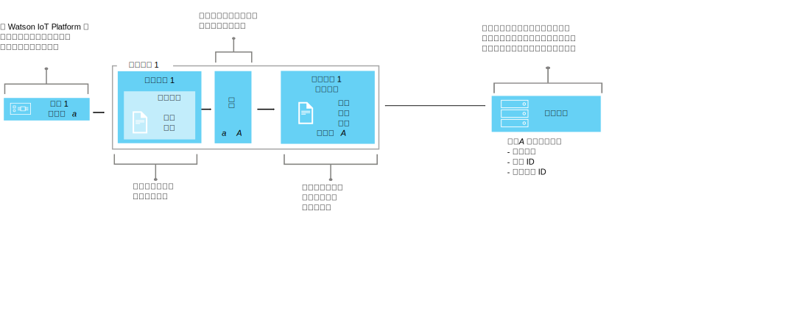

---

copyright:
  years: 2016, 2017
lastupdated: "2017-10-09"

---

{:new_window: target="\_blank"}
{:shortdesc: .shortdesc}
{:screen: .screen}
{:codeblock: .codeblock}
{:pre: .pre}


# 瞭解資料管理
{: #definitions_resources}
您可能有若干不同的裝置要連接至 {{site.data.keyword.iot_full}}，而且這些裝置可能會以不同的格式來發佈資料。使用資料管理特性，即可將裝置中的資料輸出正規化及轉換為單一邏輯視圖，以供應用程式輕鬆取用。使用單一邏輯視圖，就不需要編碼應用程式來瞭解每一個裝置所輸出的不同資料格式。
{: shortdesc}

## 概觀

使用資料管理特性來建立裝置（裝置對應項）的共用抽象化，以改善重複使用和維護，以及管理 IoT 生態系統的複雜性，同時隔離應用程式與資料變更。 

應用程式可以使用 HTTP API 或是訂閱主題字串，以在要求時存取裝置的現行狀態。狀態包含邏輯介面所定義的一組狀態內容。如果裝置的狀態因將事件發佈至 {{site.data.keyword.iot_short_notm}} 而變更，則會更新這些內容的值，並將其儲存在 {{site.data.keyword.iot_short_notm}}。

使用資料管理特性，即可達到下列好處：
- 將狀態內容對映至事件訊息資料
- 定義您喜好的資料結構
- 定義裝置狀態的多個表示法或視圖
- 訂閱裝置狀態，或隨時透過 HTTP API 進行查詢

實作資料管理特性的一些常見使用案例包括：
- 提供一致的介面，讓應用程式開發人員透過 REST 類似方式來存取事件驅動的裝置資料
- 正規化不同廠牌或型號之裝置的資料，這些裝置會以不同的格式來發佈資料
- 修改及轉換資料格式，使其符合應用程式模型

## 範例：將異質溫度感應器對映至邏輯介面
{: #device-type-example}
若要開始使用資料管理特性，您需要定義下列各節所述的一些資源。 

下列範例顯示如何使這些資源相互配合，讓應用程式以某種格式存取同質溫度狀態資料，不論裝置事件訊息有效負載格式為何。TemperatureSensor1 會將 `{ "t" : 34.5 }` 的攝氏溫度讀數發佈至 {{site.data.keyword.iot_short_notm}}。TemperatureSensor2 會發佈華氏溫度讀數 `{ "temp" : 72.55 }`。每一個溫度感應器都會與其專屬[裝置類型](../reference/device_model.html#id_and_device_types)相關聯。溫度讀數會發佈為個別事件。

使用 {{site.data.keyword.iot_short_notm}} 資料管理特性，可協助您藉由正規化及轉換裝置資料來配置此解決方案。 


在資料流程過程中，您可以對送入的資料執行計算，以將這些讀數正規化為一致形式來進行處理。這表示您不需要撰寫應用程式，即可瞭解或轉換不同的溫標。應用程式會接收單一正規化狀態，並使用 **temperature** 狀態內容，而非裝置特定 **t** 及 **temp** 內容。

 若要配置此解決方案，您需要定義下列資訊：

-	每一個裝置類型中入埠溫度事件 "t" 及 "temp" 的結構。  
-	您要記錄的 "temperature" 內容。"temperature" 內容定義應用程式可取用之裝置狀態的邏輯結構。
-	您要如何將入埠事件的 "t" 及 "temp" 內容對映至 "temperature" 內容。

您可以配置 {{site.data.keyword.iot_short_notm}} 內的下列現存資源，以定義所需的資訊：

-	實體介面、事件類型及事件綱目資源，以定義入埠事件 "t" 及 "temp" 的結構。
-	邏輯介面及邏輯綱目資源，以定義您要產生之裝置狀態 "temperature" 的邏輯結構。
-	對映資源，以定義要如何將 "t" 及 "temp" 內容對映至 "temperature" 內容。

如需可說明此範例的詳細完整情境，請參閱[逐步手冊：如何透過共用介面使用裝置的詳細範例](ga_im_index_scenario.html)。

「定義資源」小節提供這些資源的其他詳細資訊。


## 定義資源
{: #definitions_resources}

下圖說明在使用資料管理特性時，{{site.data.keyword.iot_short_notm}} 上裝置與應用程式之間的邏輯對映。



### 概念
{: #concepts}
下表說明在前一個圖表中所參照的事件、內容及狀態的概念。

概念| 說明
------------- | ------------- | -------------  
事件| 事件是裝置用來將資料發佈至 {{site.data.keyword.iot_short_notm}} 的機制。裝置會控制事件的內容，並指派名稱給它傳送的每個事件。
內容| 帶有裝置事件有效負載一部分的資料。
狀態| 實體裝置狀態的最新呈現，可包括已跨多個入埠事件對映的所有內容。

### 資料管理資源
{: #resources}

您可以使用 REST API 來管理資源。如需 REST API 的相關資訊，請參閱 [{{site.data.keyword.iot_short_notm}} HTTP REST API](https://docs.internetofthings.ibmcloud.com/apis/swagger/v0002/state-mgmt.html) 文件。

類型資源| 說明
------------- | ------------- | -------------  
事件類型| 使用事件類型資源，以建立裝置所發佈事件的模型。事件類型必須參照事件綱目資源。綱目資源定義所發佈事件的結構。</br>**重要事項：**邏輯介面中所使用的入埠事件必須為 JSON 格式。
裝置類型|  使用裝置類型資源，以將共用性質或行為的裝置群組在一起。在資料管理中，裝置類型會擴充成包括裝置的一個實體介面以及一個以上用來擷取裝置狀態的邏輯介面。</br>如需相關資訊，請參閱[裝置機型](../reference/device_model.html#id_and_device_types)主題中的「ID 及裝置類型」小節。
綱目資源|  使用綱目資源，以定義事件或裝置狀態的結構。會使用下列 [JSON 綱目 ](http://json-schema.org/){:new_window}：<ul><li>與事件類型相關聯的綱目。此綱目是用來定義裝置發佈至 {{site.data.keyword.iot_short_notm}} 之事件的結構。這些綱目稱為事件綱目。<li>與邏輯介面相關聯的綱目。此綱目是用來定義 {{site.data.keyword.iot_short_notm}} 上所儲存之裝置狀態的結構。這些綱目稱為邏輯介面綱目。</ul>  

介面資源| 說明
------------- | ------------- | -------------  
邏輯介面| 程式化建構，應用程式可連接或訂閱以查看裝置的狀態。邏輯介面用來將正規化視圖定義為 {{site.data.keyword.iot_short_notm}} 中的裝置狀態。邏輯介面必須與邏輯介面綱目相關聯。會更新狀態，以回應入埠裝置事件。
實體介面| 實體介面用來建立實體裝置與 {{site.data.keyword.iot_short_notm}} 間之介面的模型。事件類型可以與實體介面相關聯。

實例資源| 說明
------------- | ------------- | -------------  
裝置| 裝置代表向 {{site.data.keyword.iot_short_notm}} 登錄並以事件形式傳送 IoT 資料的資產、系統或元件。

支援資源| 說明
------------- | ------------- | -------------  
對映| 使用對映，以定義如何將與入埠事件相關聯的內容對映至邏輯介面上所定義的內容。</br>**重要事項：**至少一個邏輯介面必須先與裝置類型相關聯，才能定義任何對映。


## 資源的命名限制
{: #naming_restrictions}
綱目、事件類型以及邏輯和實體介面具有下列命名限制：
- 名稱必須介於 1 - 128 個字元之間 
- 名稱必須由 Unicode 字元組成 
- 有效的特殊字元包含空格、連字號 (-)、底線 (_)、句點 (.)
- 名稱不能僅包含空格

## 建立、更新、啟動及取消啟動資源
{: #draft_active_resources}

資源可以有兩種版本：初版及作用中版本。在建立資源時，會將該資源建立為初版。
{: shortdesc}

初版是資源的工作副本，您可以使用 API 直接查詢、更新及刪除。藉由啟動草稿裝置類型或草稿邏輯介面，來建立草稿資源的作用中版本。您只能啟動草稿裝置類型或草稿邏輯介面資源。若要啟動其他資源（例如綱目），您必須啟動用於參照您要啟動之資源的草稿裝置類型或草稿邏輯介面。

若要在使用 REST API 時區分草稿與作用中資源，則會使用字首 *draft/* 來識別處於草稿狀態的資源。

下列範例使用指定的 ID 來擷取草稿綱目定義的 meta 資料：

```
GET /api/v0002/draft/schemas/{schemaId}
```
下列範例使用指定的 ID 來擷取作用中綱目定義的 meta 資料：
```
GET /api/v0002/schemas/{schemaId}
```
*附註：*給定資源之草稿及作用中版本的 ID 是相同的。


- 啟動資源
{: #activate_resources}  

使用 **activate-configuration** 作業，以驗證及啟動與裝置類型相關聯的配置。此配置包括您的草稿綱目、事件類型、實體介面、邏輯介面及對映。必須對邏輯介面或裝置類型的初版執行 **activate-configuration** 作業。

下列範例顯示對裝置類型的初版執行 **activate-configuration** 作業的 PATCH 要求：
```
PATCH /api/v0002/draft/device/types/TemperatureSensor
```
其中，PATCH 主體的有效負載包含下列內容：
```
  {
    "operation": "activate-configuration"
  }
```
- 列出差異
{: #list_differences}  

使用 **list-differences** 作業，以傳回邏輯介面或裝置類型資源的作用中與草稿配置之間的所有差異清單。必須對邏輯介面或裝置類型的初版執行 **list-differences** 作業。下列範例顯示對裝置類型的初版執行 **list-differences** 作業的 PATCH 要求：
```
PATCH /api/v0002/draft/device/types/TemperatureSensor
```
其中，PATCH 主體的有效負載包含下列內容：
```
  {
    "operation": "list-differences"
  }
```


- 取消啟動資源  
{: #deactivate_resources}  

使用 **deactivate-configuration** 作業，以移除與資源相關聯的作用中配置。只能對邏輯介面及裝置類型的作用中版本執行 deactivate-configuration 作業。下列範例顯示對裝置類型的作用中版本執行 **deactivate-configuration** 作業的 PATCH 要求：
```
PATCH /api/v0002/device/types/TemperatureSensor
```
其中，PATCH 主體的有效負載包含下列內容：
```
  {
    "operation": "deactivate-configuration"
  }
```
*附註：*
- 作用中資源是唯讀的。您可以使用查詢參數，來過濾及排序草稿和作用中資源。
- 如果有與該裝置類型相關聯的裝置實例，則無法刪除該裝置類型。刪除裝置實例時，會清除裝置的狀態。 
- 您只能使用 API 直接啟動邏輯介面及裝置類型。其他資源（例如綱目、實體介面及事件類型）會在作用中的邏輯介面或裝置類型參照時啟動。  
- 必須對與裝置類型相關聯之邏輯介面的初版或裝置類型本身執行 **activate-configuration** 作業。**activate-configuration** 作業會先確認資源配置是有效的，然後再啟動資源。啟動順利完成之後，即會針對裝置類型的每一個裝置實例產生狀態。

## 配置疑難排解
{: #troubleshooting}
如果啟動失敗，請確認已提供給定裝置類型的所有必要配置。必須提供下列配置，並將其與裝置類型相關聯：
  - 至少與一個事件相關聯的實體介面
  - 至少一個邏輯介面
  - 至少一個關聯邏輯介面的對映

您也可以對裝置類型或邏輯介面資源的初版執行 **validate-configuration** 作業，以確保關聯的 meta 資料是有效的。如果 meta 資料無效，則回應主體中會傳回問題清單。  

下列範例顯示對稱為 "TemperatureSensor" 之裝置類型的初版執行 **validate-configuration** 作業的 PATCH 要求：  
```
PATCH /api/v0002/draft/device/types/TemperatureSensor
```
其中，PATCH 主體的有效負載包含下列內容：
```
  {
    "operation": "validate-configuration"
  }
```  
下列範例顯示 PATCH 要求的不成功回應：  
```
{
"message": "CUDIM0303I: State update configuration for Device Type 'TemperatureSensor' is not valid.",
"details": {
  "id": "CUDIM0303I",
  "properties": [
    "Device Type",
    "TemperatureSensor"
  ]
},
"failures": [
  {
    "message": "CUDVS0301E: The device type 'TemperatureSensor' does not have any mappings defined for it",
    "details": {
      "id": "CUDVS0301E",
      "properties": [
        "TemperatureSensor"
      ]
    }
  }
]
}
```  
下列範例顯示 PATCH 要求的成功回應：  
```  
{
"message": "CUDIM0303I: State update configuration for Device Type 'TemperatureSensor' is valid.",
"details": {
  "id": "CUDIM0303I",
  "properties": [
    "Device Type",
    "TemperatureSensor"
  ]
},
 "failures": []
}
```  
如果所有必要資源都與裝置類型相關聯，請確認內容對映都是有效的。下列範例顯示可能發生的可能錯誤：

  - 表示式參照事件上未由事件綱目所定義的內容
  - 表示式參照狀態上未由邏輯介面綱目所定義的內容
  - 對映是針對未由邏輯介面綱目所定義的內容所定義


您可以參考下列錯誤日誌，以協助您診斷運行環境錯誤：
```
iot-2/type/${typeId}/id/${devieId}/err/data
```
### 資源限制

下表顯示可根據方案類型所配置的資源數目上限。 

資源|標準方案                       | 精簡方案
------------- | ------------- | ------------- 
邏輯介面| 1000 | 10
實體介面| 1000 | 5
事件類型| 1000 | 10
綱目|2000 | 20
邏輯介面參照（裝置類型可對映至的邏輯介面數目）|20 | 5
事件類型參照（實體介面可具有之事件類型關聯的事件 ID 數目）| 40 | 10
