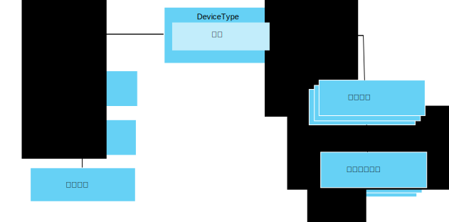

---

copyright:
years: 2016, 2017
lastupdated: "2017-07-21"

---

{:new_window: target="\_blank"}
{:shortdesc: .shortdesc}
{:screen: .screen}
{:codeblock: .codeblock}
{:pre: .pre}

# 開始使用資料管理
{: #im_example}

使用下列步驟，可協助您配置開始使用資料管理特牲所需的資源。

如需 API 的詳細資料，請參閱 [{{site.data.keyword.iot_full}} HTTP REST API ](https://docs.internetofthings.ibmcloud.com/apis/swagger/v0002/state-mgmt.html){:new_window} 文件。

**提示：**如需每一個步驟的其他詳細資訊，請參閱範例情境，或使用鏈結直接移至逐步手冊中的特定步驟。[逐步手冊：如何透過共用介面使用裝置的詳細範例](ga_im_index_scenario.html#scenario)會引導您完成各步驟，以建立異質溫度計裝置的裝置類型邏輯介面。

## 開始之前
若要開始使用資料管理特性，您必須至少具有一個已向 {{site.data.keyword.iot_short_notm}} [登錄的裝置](ga_im_index_scenario.html#step14)，並且將資料傳送至其中。  

下圖顯示您需要配置的資源如何相互配合的邏輯視圖：

## 步驟

1. 	定義送入的狀態內容。  
定義要讓邏輯介面可供應用程式使用的送入狀態內容。  
<dl>
<dd>
<ol>
<li>[建立草稿事件綱目檔](ga_im_index_scenario.html#step1)。事件綱目檔是定義入埠事件結構及格式的本端 .JSON 檔案。<li>[建立事件類型的草稿事件綱目資源](ga_im_index_scenario.html#step2)。事件綱目資源是 {{site.data.keyword.iot_short_notm}} 所使用的程式化建構。
<li>[建立參照事件綱目的草稿事件類型](ga_im_index_scenario.html#step3)。{{site.data.keyword.iot_short_notm}} 使用事件類型，以將一個以上的事件綱目資源對映至實體介面。
<li>[建立草稿實體介面](ga_im_index_scenario.html#step7)。
<li>[將事件類型新增至草稿實體介面](ga_im_index_scenario.html#step8)。
<li>[更新草稿裝置類型以連接草稿實體介面](ga_im_index_scenario.html#step9)。
</ol>
</dd>
</dl>
4. 	建立草稿邏輯介面。
 1. 	針對草稿裝置類型，[建立草稿邏輯介面綱目檔](ga_im_index_scenario.html#step4)。  
邏輯介面綱目檔是定義裝置狀態以供應用程式使用的本端 .JSON 檔案。
 2. 針對草稿裝置類型，[建立草稿邏輯介面綱目資源](ga_im_index_scenario.html#step5)。
 3.	針對草稿裝置類型，[建立草稿邏輯介面](ga_im_index_scenario.html#step6)。
 4.	[將草稿邏輯介面新增至草稿裝置類型](ga_im_index_scenario.html#step10)。
5. 	針對草稿裝置類型，[定義草稿對映](ga_im_index_scenario.html#step11)。   
對映是用來將入埠內容對映至邏輯介面中的內容。
6. 	[驗證及啟動配置](ga_im_index_scenario.html#step15)，此配置與草稿裝置類型相關聯。
7. 	[擷取作用中裝置的狀態](ga_im_index_scenario.html#step13)。  
請確認訂閱顯示已更新的裝置資料，或使用 REST 呼叫或訂閱主題來傳回已更新的裝置資料。
