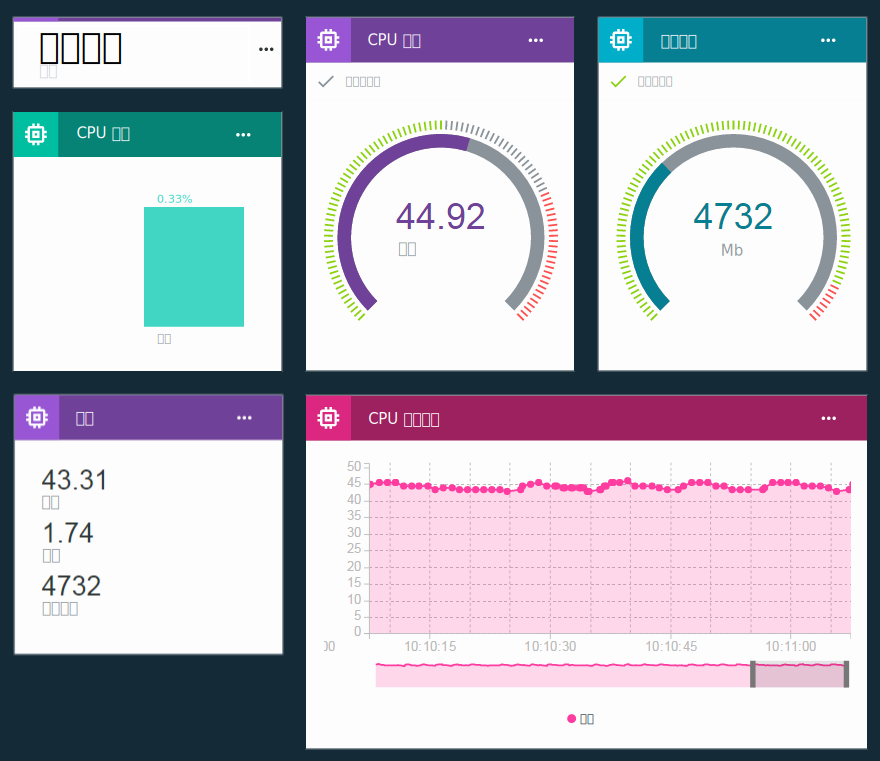

---

copyright:
  years: 2016, 2017
lastupdated: "2017-05-08"

---

{:new_window: target="\_blank"}
{:shortdesc: .shortdesc}
{:screen: .screen}
{:codeblock: .codeblock}
{:pre: .pre}
{:tip: .tip}

# 使用板及卡片視覺化即時資料
{: #boards_and_cards}

建立板及卡片，以建立及共用可即時視覺化裝置資料的專屬儀表板。
{:shortdesc}

您可以使用板及卡片，透過圖形方式視覺化一個以上裝置的資料集值，來提供快速概觀以及加強對資料的瞭解。建立板及新增卡片，用來將資料顯示為原始數字、即時圖形、量規及其他項目。將成員新增至板，以與組織中的其他使用者共用。排列卡片並新增註解文字分隔符號，以對呈現方式進行細部調整。  

您也可以[建立您自己的自訂卡片](custom_cards/custom-cards.html)，以擴充一組預設卡片。

## 預設板
{: #default_boards}
{{site.data.keyword.iot_full}} 儀表板具有下列預設板：

|板名稱| 說明| 包括的卡片
|:---|:---|:---|  
|用法概觀| 組織的用法統計資料。列出裝置類型及所使用的資料。| <ul><li>裝置類型<li>傳送的資料</ul>
|以規則為主的分析| 組織的規則。其他卡片會列出已觸發的警示、關聯的裝置、裝置內容及警示資訊。| <ul><li>我管理的規則<li>規則警示<li>規則警示資訊<li>相關聯的裝置<li>裝置資訊<li>裝置內容</ul>  
|以裝置為主的分析| 連接至組織的裝置。其他卡片會顯示所選取裝置的警示、所選取裝置的資訊、裝置內容及警示資訊。| <ul><li>我關注的裝置<li>裝置資訊<li>該裝置的規則警示<li>規則警示資訊<li>裝置內容</ul>
|風險及安全概觀（測試版）| 組織的整體安全狀態。系統操作員和安全分析師可以檢視規範的詳細資料、裝置的連線狀態、連線失敗的原因，以及透過黑名單或白名單封鎖或容許的裝置。使用者可以從「連線規範」卡片往下探查至關於非相容裝置的詳細報告，並可將該報告匯出至 Excel。| <ul><li>原則規範<li>連線安全<li>黑名單/白名單規範</ul>

您可以新增、更新及移除卡片來更新這些板。

若要將預設板重設為其原始狀態，您可以將其刪除。然後，使用原始卡片重建此板。
{: tip}

## 建立板及卡片
{: #visualizing_data}

{{site.data.keyword.iot_short_notm}} 提供內建儀表板，用來顯示裝置所傳回的即時資料。「概觀」頁面預設會顯示 {{site.data.keyword.iot_short_notm}} 組織的用量資訊（例如所使用的資料及儲存空間）。若要在流入時看到即時裝置資料，請將裝置特有卡片新增至此頁面。

如需如何顯示即時裝置資料之逐步指示的秘訣，請參閱[在新 Watson IoT 儀表板中配置板及卡片 ](https://developer.ibm.com/recipes/tutorials/configuring-the-cards-in-the-new-watson-iot-dashboard/){: new_window} 秘訣。
{: tip}

若要建立板，以及將卡片新增至該板，請執行下列動作：
1. 在 {{site.data.keyword.iot_short_notm}} 儀表板中，選取**板**。
2. 選取您具有編輯權限的板，或建立新板。
3. 在板中，按一下**新增卡片**。
3. 選取卡片類型。  
**提示：**如果您不確定要為裝置類型卡挑選哪一個視覺化，請選取**一般視覺化**。您稍後可以變更卡片類型。
<dl>
<dt>裝置</dt>
<dd><table>
<thead>
<tr>
<th>類型</th>
<th>顯示的資料</th>
</tr>
</thead>
<tbody>
<tr>
<td>一般視覺化</td>
<td>一個以上資料集的值。 **提示：**若要在小型表格中查看三個資料點值，請選擇大型小組件大小。</td>
</tr>
<tr>
<td>折線圖</td>
<td>即時捲動圖表中的一個以上資料集。使用「設定」功能表，以設定資料範圍與保留、圖形外觀與操作方式以及其他項目。</td>
<tr>
<td>長條圖</td>
<td>所標示長條中的資料集值。使用「設定」功能表，以切換水平或垂直長條方向。</td>
</tr>
<tr>
<td>環圈圖</td>
<td>以圓形呈現的兩個以上資料集。</td>
</tr>
<tr>
<td>值</td>
<td>一個以上資料集的原始值。</td>
</tr>
<tr>
<td>量規</td>
<td>顯示為量規之資料集的值。使用「設定」功能表，以選擇性地設定低、中及高資料範圍的量規臨界值。</td>
</tr>
<tr>
<td>裝置內容</td>
<td>一個以上裝置的特定內容。</td>
</tr>
<tr>
<td>所有裝置內容</td>
<td>一個以上裝置的所有內容。</td>
</tr>
<tr>
<td>裝置清單</td>
<td>監視多個裝置的清單。清單可以用作其他卡片的資料來源。 您可以依卡片設定中的裝置 ID 及類型來過濾清單。按一下卡片中的過濾圖示，也可以透過互動方式過濾大小等於或大於 L 的裝置清單。過濾器項目可以新增為單一項目、範圍 (x-y) 或以逗點區隔。  依預設，清單會顯示裝置 ID 及類型。您可以配置清單卡片設定，讓卡片同時顯示其他裝置 meta 資料。</td>
</tr>
<tr>
<td>裝置資訊</td>
<td>單一裝置的基本資訊。</td>
<tr>
<td>裝置地圖</td>
<td>裝置清單中裝置的位置。</td>
</tr>
</tbody>
</table>
</dd>
<dt>分析</dt>
<dd>
<table>
<thead>
<tr>
<th>類型</th>
<th>顯示的資料</th>
</tr>
</thead>
<tbody>
<tr>
<td>規則</td>
<td>具有警示的規則清單。</td>
</tr>
<tr>
<td>規則警示</td>
<td>裝置的警示清單。</td>
</tr>
<tr>
<td>警示資訊</td>
<td>單一警示的基本資訊。</td>
</tr>
</tbody>
</table>
</dd>
<dt>風險管理（測試版）</dt>
<dd>只有[進階安全](reference/security/RM_security.html)組織才提供。
<table>
<thead>
<tr>
<th>類型</th>
<th>顯示的資料</th>
</tr>
</thead>
<tbody>
<tr>
<td>原則規範</td>
<td>連線安全以及黑名單和白名單裝置的概觀。</td>
</tr>
<tr>
<td>黑名單/白名單規範</td>
<td>黑名單或白名單裝置數目。</td>
</tr>
<tr>
<td>連線安全</td>
<td>讓連線安全檢查失敗的裝置數目。</td>
</tr>
</tbody>
</table>
</dd>
<dt>用法</dt>
<dd>
<table>
<thead>
<tr>
<th>類型</th>
<th>顯示的資料</th>
</tr>
</thead>
<tbody>
<tr>
<td>裝置類型</td>
<td>該圓餅圖顯示組織中每個裝置類型的已登錄裝置數目。</td>
</tr><tr>
<td>傳送的資料</td>
<td>組織已傳送資料的用法統計資料。</td>
</tr>
</tbody>
</table>
</dd>
<dt>基本</dt>
<dd>
<table>
<thead>
<tr>
<th>類型</th>
<th>顯示的資料</th>
</tr>
</thead>
<tbody>
<tr>
<td>分隔字元</td>
<td>在板上建構及分組卡片的水平分隔字元。</td>
</tr>
</tbody>
</table>
</dd>
</dl>

4.	選取卡片來源資料。  
選取一個以上的卡片資料來源，然後按**下一步**。  
資料來源可以是單一已登錄裝置或其他卡片。若要使用卡片資料來源，板上必須要有清單或對映卡片。  
5. 為每一個資料來源新增一個以上的資料集。
 - 裝置
    2. 選取包含所要顯示之資料點的事件。
    3.	選取代表資料點的內容。
    1.	提供資料集的識別性名稱。
    4.	設定資料點的類型、單位、精準度、最小值及最大值。  
    完成之後，即可按一下**新建資料集**來新增更多資料集，或按**下一步**。
 - 清單
    2. 選取裝置類型，或選取**任何裝置類型**。
    2. 選取包含所要顯示之資料點的事件。
    3.	選取代表資料點的內容。
    1.	提供資料集的識別性名稱。
    4.	設定資料點的類型、單位、精準度、最小值及最大值。  
    完成之後，即可按一下**新建資料集**來新增更多資料集，或按**下一步**。
5.	自訂卡片預覽中的卡片視覺化。  
 7. 選取呈現大小。  
除了設定板上的卡片大小之外，卡片大小設定也會控制其他呈現變數，例如，列出的裝置數目、顯示的圖形 meta 資料等。   
**提示：**按一下不同大小標籤，以查看大小不同的卡片的預覽。
 8. 配置任何其他設定。  
如果卡片支援它，請按一下**設定**以查看您可配置的其他設定，例如，量規類型卡片的資料範圍以及裝置清單卡片的過濾選項。
6. 更新卡片資訊。  
 1. 提供卡片的標題及說明，以及選擇性地選取色系。   
 2. 按一下**提交**以建立卡片。
7.	將新卡片拖曳至適當位置，以將其定位在板上。  
